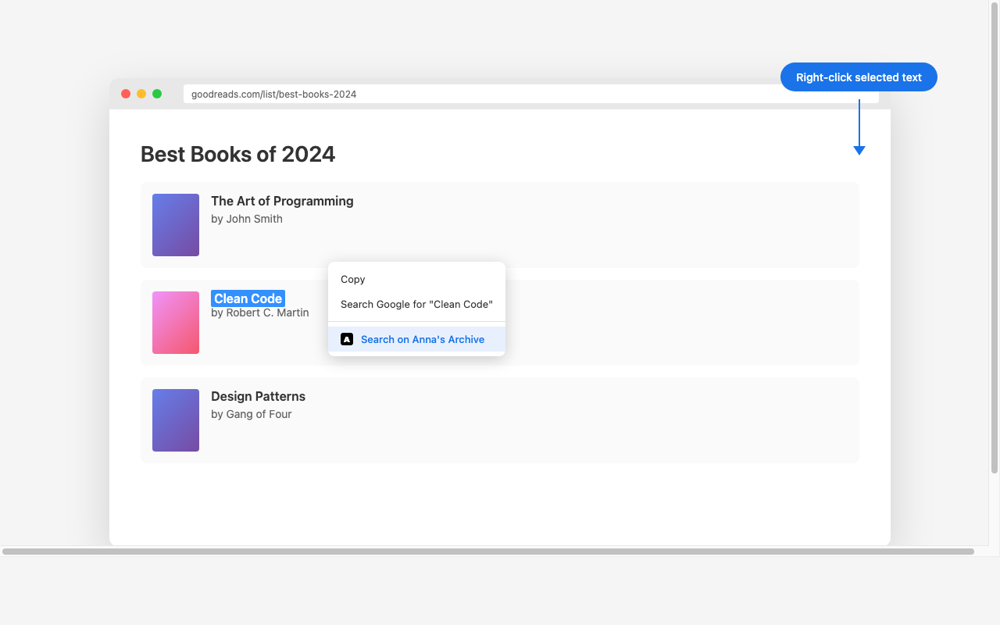

# Search on Anna's Archive

A lightweight Chrome extension that lets you search for books, papers, and documents on [Anna's Archive](https://annas-archive.li/) directly from any webpage.



## Features

- **Fast and simple** - just two clicks to search
- **Works on any webpage** - select any text and right-click
- **Lightweight** - no background processes, minimal permissions
- **Privacy-focused** - no data collection, no tracking
- **Open source** - MIT licensed

## Installation

### From Chrome Web Store

*(Coming soon)*

### Manual Installation

1. Download or clone this repository
2. Open Chrome and go to `chrome://extensions/`
3. Enable **Developer mode** (top right corner)
4. Click **Load unpacked**
5. Select the repository folder

## Usage

1. Select any text on a webpage (book title, author name, ISBN, etc.)
2. Right-click to open the context menu
3. Click **"Search on Anna's Archive"**
4. A new tab opens with your search results


## Files

```
annas/
├── manifest.json      # Extension configuration
├── background.js      # Context menu logic
├── icon16.png         # 16x16 icon
├── icon48.png         # 48x48 icon
├── icon128.png        # 128x128 icon
├── store-assets/      # Chrome Web Store images
│   ├── screenshot.png
│   ├── promo-tile.png
│   └── marquee-tile.png
└── assets/            # Source files for images
```

## Privacy Policy

**Search on Anna's Archive** respects your privacy:

- **No data collection** - This extension does not collect, store, or transmit any personal data
- **No tracking** - No analytics, cookies, or tracking of any kind
- **No external servers** - All functionality runs locally in your browser
- **Minimal permissions** - Only requests the `contextMenus` permission required for core functionality
- **Open source** - The complete source code is available for review

The extension only reads the text you select when you explicitly right-click and choose "Search on Anna's Archive". This text is sent directly to Anna's Archive search URL and is not stored or processed by the extension.

## License

MIT License - feel free to use, modify, and distribute.

## Contributing

Contributions are welcome! Feel free to open issues or submit pull requests.
